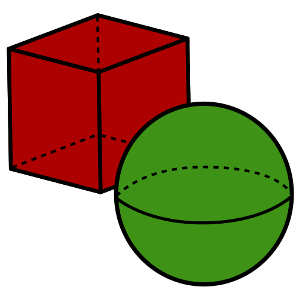

# volume-calculator-gui-tkinter
<div align='center'>
    
</div>
<hr>

Proyecto del Grupo 1 de la Comisión 2 del Informatorio 2025.

Aplicación de cálculo del volumen de un cuerpo geométrico con interfaz gráfica empleando tkinter.

## Contenido
- [Uso de la aplicación](#uso-de-la-aplicación)
- [Añadir formas geométricas](#añadir-formas-geométricas)
    - [Añadir el código](#añadir-el-código)
    - [Añadir imágenes](#añadir-imágenes)
    - [Cambiar la variable bodies](#cambiar-la-variable-bodies)
    - [Ejecutar la aplicación](#ejecutar-la-aplicación)

## Uso-de-la-aplicación
1. Abrir la aplicación.
    - Utilizando el ejecutable `.exe`

    - Llamando con python el código `main.py`
    ```bash
    python main.py
    ```

2. Selección del cuerpo geométrico desde el menu `figuras` del menú principal.
<div align="center">
  
</div>

3. Añadir los valores de las dimensiones.
<div align="center">
  
</div>

4. Lectura de los resultados de los valores de volumen y superficie. Haciendo click derecho con el mouse se puede seleccionar la opción de copiar el resultado obtenido. 
<div align="center">
  
</div>

## Añadir-formas-geométricas

### Añadir-el-código
```python
from calculator import Body

class NewBody(Body):
    def __init__(self, value = 0, value2 = 0):
        # En el init de la super clase se debe ingresar el nombre y las variables que correspondan a sus dimensiones.
        super().__init__(
            name = 'BodyName',
            valueName = value,
            value2Name = value2
        ) 

    # Para utilizar los valores de los parámetros se deberán utilizarel método}: self.get('valueName');

    # Método abstracto --> Calcular volumen
    def volume(self):
        return self.get('valueName') * self.get('value2Name')

    # Método abstracto --> calcular superficie
    def surface(self):
        return self.get('valueName') * self.get('value2Name')
```

### Añadir-imágenes
Se puede agregar una imagen del cuerpo geométrico en la carpeta `images` con el nombre de la forma en minúscula, y con formato `PNG`. Siendo para el ejemplo anterior: `images/bodyname.png`

### Cambiar-la-variable-bodies
En el código `main.py` se recorren los elementos dentro del diccionadio `bodies` para armar la interfaz gráfica, se puede agregar el nuevo cuerpo, siempre y cuanto su nombre sea único en la lista. O borrando el contenido y reemplazarlo por el nuevo objeto.
- Agregar el objeto a la lista con las formas ya provistas.
```python
#...
bodies.append(NewBody()) 
#...
```
- Reemplazar la lista con nuevas formas.
```python
#...
bodies = [NewBody()]
#...
```
### Ejecutar-la-aplicación
Para utilizar las nuevas formas se requiere ejecutarlo desde `main.py`.
```bash
python main.py
```